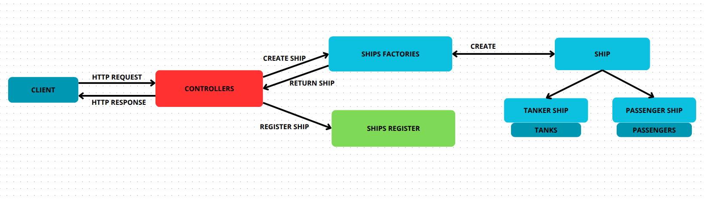

# FleetAPI 🚢

## Overview

FleetAPI is a C# Web API that provides end-to-end management of a mixed fleet of Passenger and Tanker ships. It enforces strict validation of all important data like IMO numbers (see [here](https://en.wikipedia.org/wiki/IMO_number)), physical dimensions and Passenger or Tank data integrity.  

For full requirements for this task see [Requirements](documentation/requirements.pdf).  


## Table of Contents
- [Overview](#overview)
- [Way of Thinking](#way-of-thinking)
- [Project Structure](#project-structure)
- [Use Cases](#use-cases)
- [Try It Out](#try-it-out)
- [Example API Endpoints](#example-api-endpoints)
- [Tests](#tests)

## Way of Thinking

Application uses several key patterns and data structures to keep the design clean, performant, and easy to extend.

To provide clear and specific error messages, the project includes custom exception classes. These exceptions ensure users can easily understand the context of exception.

#### Factory Design Pattern  
Rather than creating all the time new objects of `PassengerShip` or `TankerShip` directly all over the codebase, construction logic is in factories (`PassengerShipFactory` and `TankerShipFactory`). Each factory handles the specific validation and initialization for its ship type—checksuming the IMO, enforcing non-negative dimensions, wiring up the passenger list or fuel-tank collection—so that the controllers and repositories never need to know those details.

#### Ships Register: `HashSet<Ship>`  
We store all ships in an in-memory `HashSet<Ship>` keyed on IMO number. Using a hash set gives us:
- **Automatic duplicate prevention** (no two ships can share the same IMO)  
- **O(1) existence checks** for quick `Exists(imo)` lookups  
- **Fast add/remove** semantics when registering or deregistering 

Because IMO numbers are globally unique, a hash‐based collection is the natural fit.

#### Internal Collections: `List<Passenger>` & `List<Tank>`  
Once a ship is created, its sub-collections use `List<T>`:
- **`PassengerShip`** maintains a `List<Passenger>` preserving insertion order and allowing access based on an index.  
- **`TankerShip`** holds a `List<Tank>`  enabling indexed access when filling or emptying individual tanks.

Lists give us the flexibility to grow and iterate in a predictable order, which is ideal for passenger lists and tank inventories.


## Project Structure

fleetAPI/
├── Controllers/       # Web API controllers
├── Data/              # Ship Register
├── Factories/         # Ship factory implementations
├── Exceptions/        # Custom exception types
├── Models/            # Domain models (Ships, Tanks, Passengers, DTOs)
└── fleetAPI_tests/    # test project




This diagram provides a visual representation of the FleetAPI project structure, illustrating the relationships between controllers, data, factories and client.

In this Create Ship scenario, the client POSTs JSON to /api/shipregister/create, which the controller binds to a ShipDto. The controller then invokes the appropriate factory to build and validate a PassengerShip or TankerShip domain object, adds it to the in-memory hash-based register, and returns a 201 Created with the ship’s data.

## Use Cases

#### Passenger Ship Use Cases

- **Register a new passenger ship**  
    Add a Passenger Ship to the fleet registry.

- **Add passenger to list**  
    Add a new passenger to the list of passengers on a registered Passenger Ship.

- **Update passenger information**  
    Update passenger details on a registered Passenger Ship.

- **Remove passenger from list**  
    Remove a passenger from the list on a registered Passenger Ship.

#### Tanker Ship Use Cases

- **Register a new tanker ship**  
    Add a Tanker Ship to the fleet registry.

- **Refuel a tanker tank**  
    Add a specified amount of fuel to a particular tank on a Tanker Ship.

- **Empty a tanker tank**  
    Remove all fuel from a specific tank on a Tanker Ship.


**Assumptions**

- Tanks are installed on Tanker Ship once - in a constructor

## Try it out

#### 1. **Run the API**  
   ```bash
   dotnet run
   ```

#### 2. **Send HTTP requests**

**Example HTTP requests**
Using curl

- Register a Passenger Ship
```json
curl -X POST http://localhost:5000/api/shipregister/create \
  -H "Content-Type: application/json" \
  -d '{
        "imoNumber": "IMO9074729",
        "name":      "Black Pearl",
        "length":    300,
        "width":     50,
        "shipType":  0,
        "passengers":[
          { "name":"Jack", "surname":"Sparrow" }
        ],
        "tanks":     null
      }'
```

- Add a Passenger
```json
curl -X POST http://localhost:5000/api/passengership/IMO9074729/passengers/add \
  -H "Content-Type: application/json" \
  -d '{
        "name":    "Will",
        "surname": "Turner"
      }'
```

- Get Ships by Type
```json
curl http://localhost:5000/api/shipregister/getShips/Passenger
```
## Example API Endpoints

- **POST** `/api/shipregister/create`  
  Create a new Passenger or Tanker ship.

- **GET** `/api/shipregister/getShips/{shipType}`  
  Get all ships of a specific type (Passenger, Tanker).

- **POST** `/api/passengership/{imo}/passengers/add`  
  Add a passenger to a PassengerShip by IMO number.

- **PUT** `/api/passengership/{imo}/passengers/update/{index}`  
  Update a passenger’s information by id on a PassengerShip.

- **DELETE** `/api/passengership/{imo}/passengers/remove/{index}`  
  Remove a passenger by id from a PassengerShip.

- **POST** `/api/tankership/{imo}/tanks/fill/{index}`  
  Fill a specific tank with fuel on a TankerShip.

- **POST** `/api/tankership/{imo}/tanks/empty/{index}`  
  Empty a specific tank on a TankerShip.

## Tests

In ControllersTests I verify each API endpoint’s HTTP responses (using Moq and xUnit). In ShipsTests I test the ships and in-memory register behavior. To run the full suite:

```bash
cd fleetAPITests
dotnet test
```


